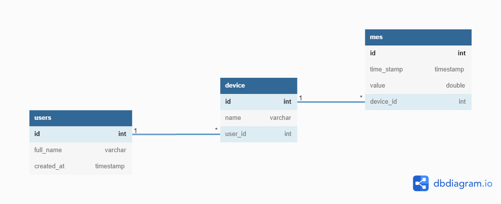

# Pythonanywhere-Flask
Development of an example of a simple platform for the Internet of Things on the example of a thermometer and a remote switch.

Project database on [https://dbdiagram.io/](https://dbdiagram.io/)
 
Lern about database on [www.w3schools.com](https://www.w3schools.com/sql/sql_ref_database.asp)
 

Go to sample [Flask app](sample.py)

